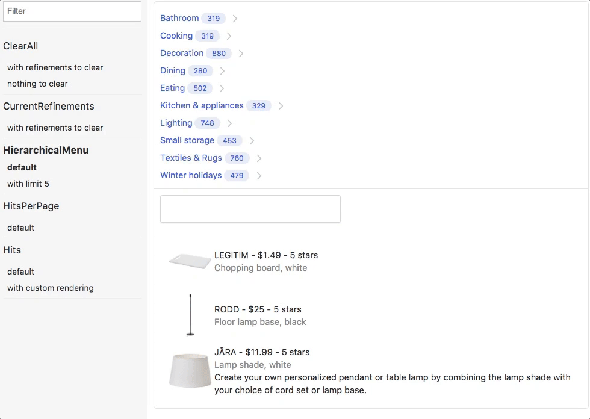
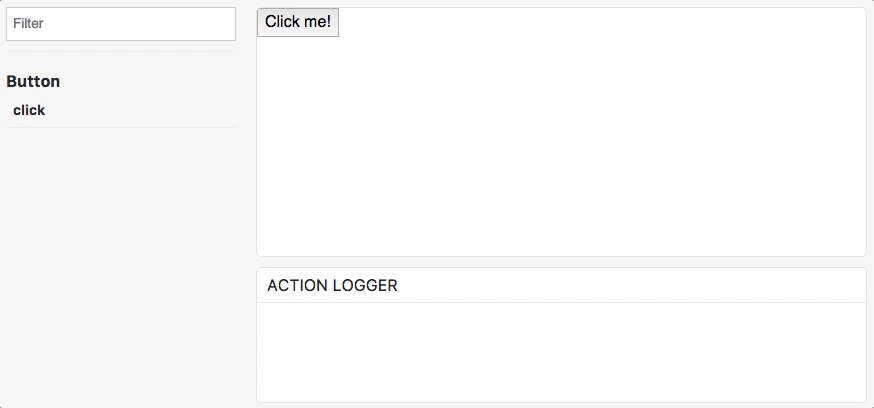

# dev-novel.js

> dev-novel.js is a clone of the well known [storybook.js](https://github.com/storybooks/storybook). It allows you to browse through example of a library. It's less complete than Storybook but works with every JS library, it's not linked to React components exclusively.



## Getting started

### Installation

Since the project is still private, you will need to clone and build dev-novel.js by yourself in order to use it in your project:

* `$ git clone git@github.com:algolia/dev-novel.js.git`
* `$ cd dev-novel.js && yarn && yarn link`

Then in your project you simply run:

* `$ yarn link dev-novel.js`

You will also need to provide your own build system, we are not providing an minified/unified build for the moment. So use either webpack, rollup or browserify to start your dev environment.

### Usage

1. **First define your stories:**

  ```javascript
  import { storiesOf } from 'dev-novel.js'

  storiesOf('My first story')
    .add('Hello world', (container: HTMLDivElement) => {
      // create `<h1>Hello world</h1>`
      const title = document.createElement('h1')
      title.innerText = 'Hello world'

      // display it into the story result
      container.appendChild(title)
    })
  ```

2. **You can add initializers / disposers that runs before and after your story:**

  This can be useful when you need to provide globals for your story, for instance depending onto another library.

  ```javascript
  import { registerInitializer, registerDisposer, storiesOf } from 'dev-novel.js'

  registerInitializer(() => {
    window._appState = {
      user: {
        firstName: 'Max',
        lastName: 'Tyler'
      }
    }
  })

  registerDisposer(() => {
    window._appState = undefined
    delete window._appState
  })

  storiesOf('User profile')
    .add('Display user fullname', (container: HTMLDivElement) => {
      const span = document.createElement('span')
      span.innerText = `${window._appState.user.firstName} ${window._appState.user.lastName}`

      container.appendChild(span)
    })
  ```

3. **Finally start dev-novel UI and open your page:**

  ```javascript
  import { start, storiesOf } from 'dev-novel.js'

  [...]

  start({
    openAllStories?: boolean // open all parent stories item in the menu by default
  })
  ```

### Use the ActionLogger

With actions, you can inspect events and log them directly into the page. This is pretty neat when you are manually testing your components.

```javascript
import { action, registerDisposer, storiesOf } from 'dev-novel.js'

// remove all event listeners when switching to another story
const eventDisposers = []
registerDisposer(() => { eventDisposers.forEach(disposer => disposer()) })

storiesOf('Button')
  .add('click', container => {
    const handler = action('button-click')
    const button = document.createElement('button')
    button.innerText = 'Click me!'
    button.addEventListener('click', handler, false)

    // remove event listener after story ran
    const disposer = () => button.removeEventListener('click', handler, false)
    eventDisposers.push(disposer)

    // append button
    container.appendChild(button)
  })
```



### TODO

* [ ] Provide initializers/disposers per stories
* [ ] Provide an UMD build for usage in the browser
* [ ] Open source / publish to NPM?
